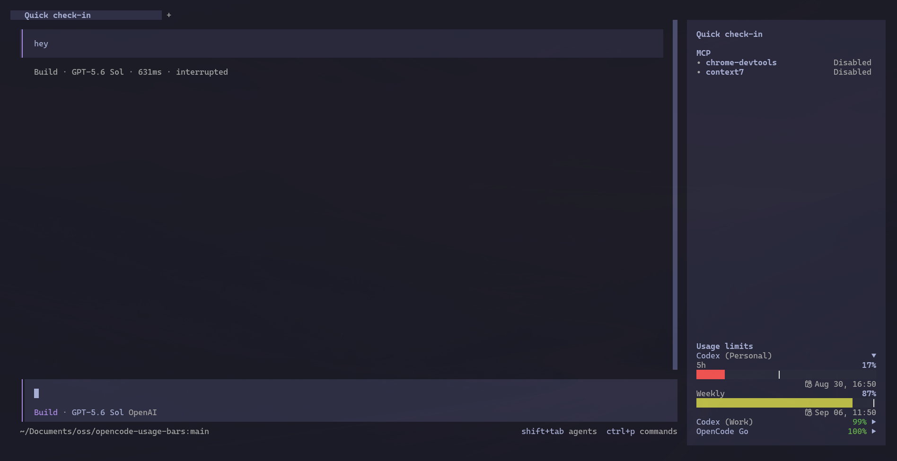
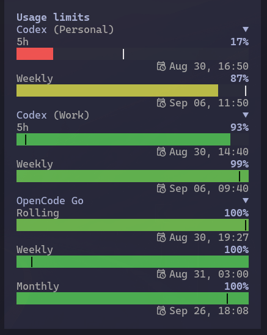
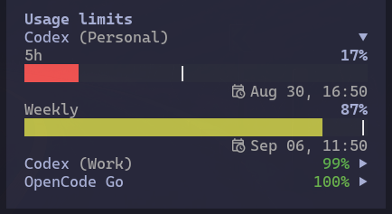

# opencode-usage-bars

Usage bars for the OpenCode V2 TUI sidebar.

The filled bar shows remaining usage. The `|` marker shows how much time remains in the limit window. Bar color compares usage with elapsed time: green is safely on pace, yellow is ahead of pace, and red is substantially ahead or exhausted.

## Installation

Install the plugin:

```sh
opencode2 plugin add opencode-usage-bars
```

The plugin resolves connected credentials, fetches usage, and renders the bars in the TUI sidebar.



## Screenshots

<table>
  <tr>
    <th>Expanded usage bars</th>
    <th>Collapsed summaries</th>
  </tr>
  <tr>
    <td valign="top"></td>
    <td valign="top"></td>
  </tr>
</table>

## Features

- Pace-aware green-to-yellow-to-red color gradient
- Collapsible account summaries colored by their worst limit
- Reset timestamps with fixed-width day and time fields

The reset indicator uses a Nerd Font icon. Install a Nerd Font in your terminal for the intended appearance.

## Supported Providers

> [!NOTE]
> This is the current provider list. Support for additional providers is planned.

- **Codex:** 5-hour and weekly limits, with support for multiple accounts and their stored OpenCode account labels.
- **OpenCode Go:** rolling, weekly, and monthly limits.

## Development

```sh
bun install
bun run check
```

For local development, reference `src/index.ts` as a server plugin and `src/tui.tsx` as a CLI plugin. Both processes share usage data through `$XDG_CACHE_HOME/opencode/usage-bars.json`, or `~/.cache/opencode/usage-bars.json` when `XDG_CACHE_HOME` is unset.

## Limitations

Usage data is currently cached locally, so the server and TUI must run on the same machine. Remote-server TUI connections do not display usage bars.
