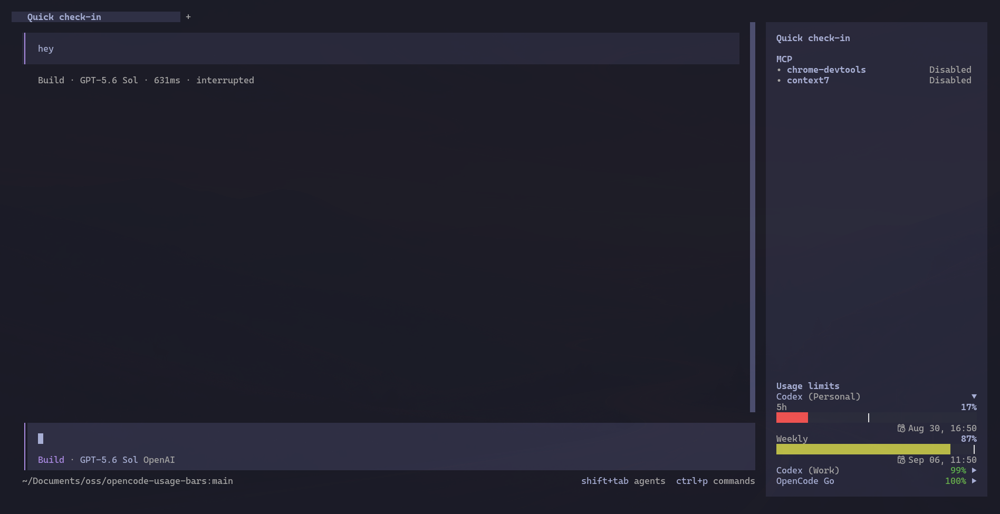
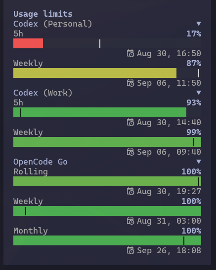
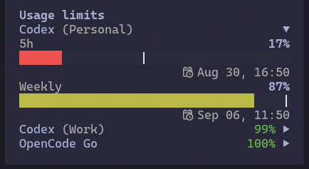

# opencode-usage-bars

Usage bars for the OpenCode V2 TUI sidebar and desktop GUI (OpenCode 2.2.0+).

The filled bar shows remaining usage. The `|` marker shows how much time remains in the limit window. Bar color compares usage with elapsed time: green is safely on pace, yellow is ahead of pace, and red is substantially ahead or exhausted.

## Installation

Install the plugin:

```sh
opencode2 plugin add opencode-usage-bars
```

The plugin resolves connected credentials, fetches usage, and renders the bars in the TUI sidebar.

On desktop, run **Open usage limits** from the command palette, choose **Usage limits** from the side panel's **+** menu, or open **Settings > Usage limits**. The desktop GUI API is experimental.



## Screenshots

<table>
  <tr>
    <th>Expanded usage bars</th>
    <th>Collapsed summaries</th>
  </tr>
  <tr>
    <td valign="top"></td>
    <td valign="top"></td>
  </tr>
</table>

## Features

- Pace-aware green-to-yellow-to-red color gradient
- Collapsible account summaries colored by their worst limit
- Time remaining until reset by default; click to toggle the reset date and time
- Compact desktop rows with explicit “% left” labels and accessible pace descriptions
- Desktop Refresh fetches fresh provider usage; overlapping refreshes share one request
- Failed account reads retain last-known usage with a stale indicator and last-success time; credential changes clear old readings
- Desktop reset countdown/date mode is shared across all bars; click any reset time to switch them together
- The gear beside “Last checked” saves desktop 12/24-hour clock and countdown/date preferences
- Click “Last checked” to switch the clock format for all displayed times
- Collapsed desktop providers show their designated summary percentage, with the same pace-color rules as the TUI

The countdown uses an hourglass icon; the reset date and time use a calendar icon. The TUI uses Nerd Font icons; install a Nerd Font in your terminal for the intended appearance. Desktop uses SVG icons and does not require a Nerd Font.

## Supported Providers

> [!NOTE]
> This is the current provider list. Support for additional providers is planned.

- **Codex:** 5-hour and weekly limits, with support for multiple accounts and their stored OpenCode account labels.
- **OpenCode Go:** rolling, weekly, and monthly limits.

## Development

```sh
bun install
bun run check
```

For local development, replace the npm package entry in your global `~/.config/opencode/opencode.json(c)` with the absolute path to this checkout:

```jsonc
{
  "plugins": ["/absolute/path/to/opencode-usage-bars"]
}
```

Run `bun run check` first to build the desktop bundle. Then use `bun run dev:gui` to rebuild and hot-reload desktop changes. The local directory loads the server, TUI, and GUI parts through `package.json`; do not also list a separate TUI entry in `cli.json`.

The desktop reads usage through server RPC, without accessing local files or credentials. The TUI still shares usage through `$XDG_CACHE_HOME/opencode/usage-bars.json`, or `~/.cache/opencode/usage-bars.json` when `XDG_CACHE_HOME` is unset.

### Windows desktop with a WSL server

Desktop loads GUI plugins from its own Windows background server, not from connected WSL or remote servers. Keep the full plugin configured on the WSL server to collect usage, and install a GUI-only local copy on Windows:

```sh
bun run check
bun run sync:desktop /mnt/c/Users/YOUR_USER/.config/opencode/local/usage-bars-gui --watch
```

Add this directory to **Windows** `C:/Users/YOUR_USER/.config/opencode/opencode.jsonc`, preserving any other plugins:

```jsonc
{
  "plugins": ["C:/Users/YOUR_USER/.config/opencode/local/usage-bars-gui"]
}
```

Run `bun run dev:gui` in another terminal. The sync watcher copies each rebuilt bundle to Windows, where Desktop reloads it. No npm package installation, UNC-path dependencies, or copied credentials are needed.

Open a WSL session and run **Open usage limits**. The panel shows its source server and reads usage through that session's client and location. Switching servers clears the previous source's usage and cancels outstanding requests. The Settings page follows the current session when one is available; without a session it uses the desktop's own server, which needs the full plugin to provide usage.

## Limitations

The server and TUI must run on the same machine. Remote-server TUI connections do not display usage bars. Desktop can show a remote session's usage, but the full plugin must be installed on that server and the GUI must be installed on the desktop's own server.
